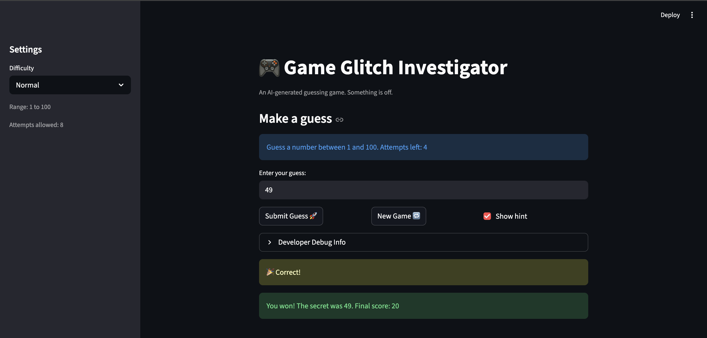
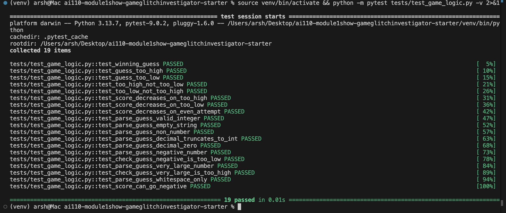

# 🎮 Game Glitch Investigator: The Impossible Guesser

## 🚨 The Situation

You asked an AI to build a simple "Number Guessing Game" using Streamlit.
It wrote the code, ran away, and now the game is unplayable. 

- You can't win.
- The hints lie to you.
- The secret number seems to have commitment issues.

## 🛠️ Setup

1. Install dependencies: `pip install -r requirements.txt`
2. Run the broken app: `python -m streamlit run app.py`

## 🕵️‍♂️ Your Mission

1. **Play the game.** Open the "Developer Debug Info" tab in the app to see the secret number. Try to win.
2. **Find the State Bug.** Why does the secret number change every time you click "Submit"? Ask ChatGPT: *"How do I keep a variable from resetting in Streamlit when I click a button?"*
3. **Fix the Logic.** The hints ("Higher/Lower") are wrong. Fix them.
4. **Refactor & Test.** - Move the logic into `logic_utils.py`.
   - Run `pytest` in your terminal.
   - Keep fixing until all tests pass!

## 📝 Document Your Experience

**Purpose:**
A Streamlit number-guessing game where the player tries to guess a secret number within a limited number of attempts. The game gives "Too High" / "Too Low" hints after each guess and tracks a score that increases on a win and decreases on wrong guesses. Difficulty settings change the number range and attempt limit.

**Bugs found:**
1. **Hints were backwards** — `check_guess` returned "Go HIGHER!" when the guess was too high and "Go LOWER!" when it was too low, pointing the player in the wrong direction every time.
2. **Score miscalculated on even attempts** — `update_score` added 5 points on even-numbered "Too High" guesses instead of subtracting them, causing the score to jump unexpectedly.
3. **Attempts counter off by one** — `st.session_state.attempts` was initialized to `1` instead of `0`, so the "Attempts left" display was wrong before any guess was made.

**Fixes applied:**
- Corrected the hint messages in `check_guess` so "Too High" maps to "Go LOWER!" and "Too Low" maps to "Go HIGHER!"
- Rewrote `update_score` to always subtract 5 for any wrong guess, regardless of attempt number.
- Changed the attempts initializer from `1` to `0`.
- Refactored all game logic out of `app.py` and into `logic_utils.py` to separate UI from logic and make functions independently testable.

## 📸 Demo

- [ ] 

## ✅ Challenge 1: Edge-Case Test Results

- [ ] 

## 🚀 Stretch Features

- [ ] [If you choose to complete Challenge 4, insert a screenshot of your Enhanced Game UI here]
